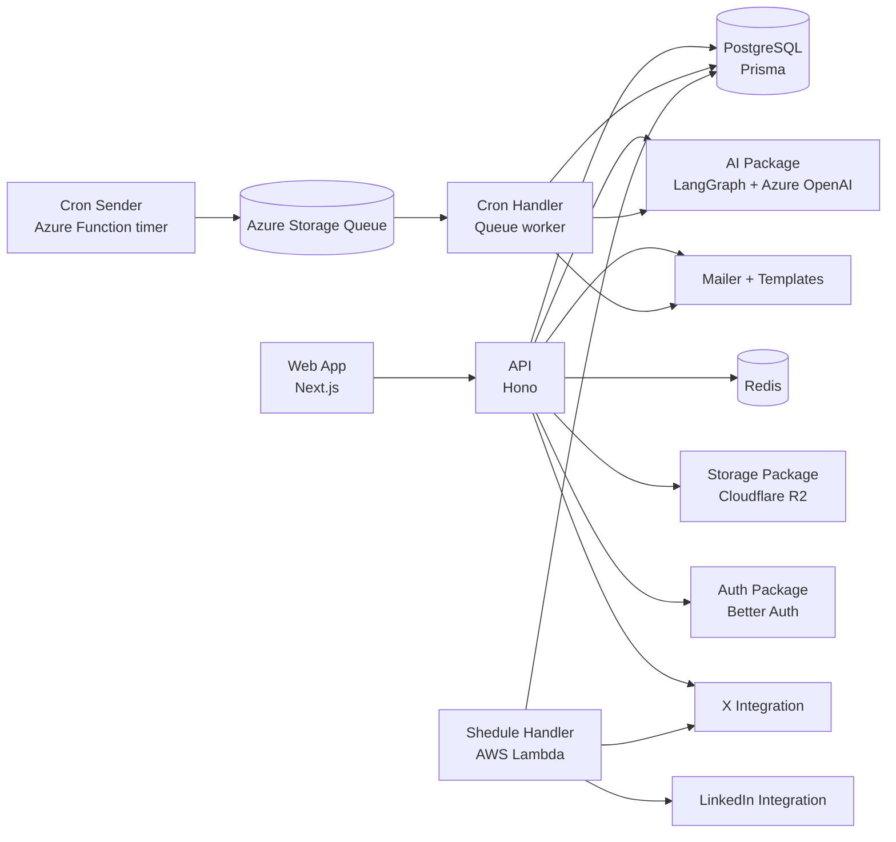

# Postcribe

Postcribe is an AI-assisted social publishing platform built as a Bun + Turborepo monorepo.  
It includes a web app, API, automation workers, and shared packages for auth, AI generation, storage, mail, and social integrations.

## Core capabilities

- AI-generated post drafts for X and LinkedIn
- AI-generated image workflow with Cloudflare R2 storage
- Draft and automation (cron) management
- Authentication with Better Auth (email/password + Google)
- Social account management (currently X-focused in active routes)
- Email notifications for approval and account flows

## Architecture



## Monorepo layout

```text
apps/
  api/              Hono API server (port 3000)
  web/              Next.js frontend (port 3001)
  cron-sender/      Azure Function timer -> queue producer
  cron-handler/     Queue consumer + AI/email processing
  shedule-handler/  AWS Lambda scheduled publisher (legacy/parallel path)

packages/
  ai/               LangGraph workflows (post/image/suggestions/name)
  auth/             Better Auth configuration + email flows
  db/               Prisma schema/client + migrations
  x/                X integration helpers (RapidAPI-based data path active)
  linkedin/         LinkedIn client helpers
  s3/               Cloudflare R2 uploads
  redis/            Redis client
  mailer/           SMTP email sender
  mail-templates/   MJML templates
  logger/           Pino logger wrapper
  eslint-config/    Shared ESLint config
  typescript-config Shared TS config
```

## Tech stack

- Runtime/package manager: Bun (`bun@1.2.13`)
- Monorepo orchestration: Turborepo
- Language: TypeScript
- Frontend: Next.js 15, React 19, Tailwind CSS
- API: Hono + Zod
- Database: PostgreSQL + Prisma
- Cache: Redis
- AI: LangChain/LangGraph + Azure OpenAI + Tavily
- Queue/worker: Azure Functions + Azure Storage Queue
- Additional worker path: AWS Lambda

## Prerequisites

- Bun `1.2.13+`
- Node.js `>=18` (for ecosystem tooling)
- PostgreSQL
- Redis
- SMTP credentials (required for API startup)

Optional for automation development:

- Azure Functions Core Tools v4
- Azurite (or Azure Storage account)
- Docker

## Quick start (local)

### 1) Install dependencies

```bash
bun install
```

### 2) Configure environment files

```bash
cp apps/api/.env.example apps/api/.env
cp apps/web/.env.example apps/web/.env.local
```

At minimum, set the following for `apps/api/.env`:

- Core: `DATABASE_URL`, `AI_DB_URL`, `REDIS_URL`, `ENVIRONMENT`, `CLIENT_URL`, `TRUSTED_ORIGINS`
- Auth: `BETTER_AUTH_URL`, `BETTER_AUTH_SECRET`, `GOOGLE_CLIENT_ID`, `GOOGLE_CLIENT_SECRET`
- AI: `TAVILY_API_KEY`, `AZURE_OPENAI_ENDPOINT`, `AZURE_OPENAI_API_KEY`, `AZURE_OPENAI_ENDPOINT_IMAGE`, `AZURE_OPENAI_API_KEY_IMAGE`
- Storage: `R2_API_URL`, `R2_ACCESS_KEY_ID`, `R2_SECRET_ACCESS_KEY`, `R2_BUCKET_NAME`, `R2_PUBLIC_URL`
- Email: `SMTP_HOST`, `SMTP_PORT`, `SMTP_USER`, `SMTP_PASS`

For `apps/web/.env.local`, configure:

- `NEXT_PUBLIC_BETTER_AUTH_URL` (default: `http://localhost:3000/v1/auth`)
- `NEXT_PUBLIC_API_URL` (default: `http://localhost:3000/v1`)
- `NEXT_PUBLIC_CLIENT_URL` (default: `http://localhost:3001`)

### 3) Prepare the database

```bash
bun --cwd packages/db run db:generate
bun --cwd packages/db run db:migrate
```

### 4) Run API and web app

Terminal 1:

```bash
bun --cwd apps/api run dev
```

Terminal 2:

```bash
bun --cwd apps/web run dev
```

Open `http://localhost:3001`.

## Automation workers

### Azure queue pipeline

- `apps/cron-sender`: every minute (`0 * * * * *`) pushes due cron jobs to `post-schedule-queue`
- `apps/cron-handler`: consumes queue messages, generates draft content/images, and sends approval emails

Local run:

```bash
# sender (requires Azure Functions tooling + AzureWebJobsStorage)
bun --cwd apps/cron-sender run start

# handler
bun --cwd apps/cron-handler run dev
```

### Scheduled publish Lambda

`apps/shedule-handler` processes scheduled drafts and publishes to platforms via `@repo/x` and `@repo/linkedin`.

## API surface (active routes)

Base path: `/v1`

- Auth: `POST|GET /auth/*`
- Draft/AI:
  - `POST /post/draft`
  - `POST /post/draft/apply`
  - `POST /post/draft/image/upload`
  - `POST /post/draft/image/generate`
  - `POST /post/suggestions`
  - `POST /post/draft/name`
  - `GET /post/draft/posts`
  - `GET /post/drafts`
- Automations:
  - `GET /post/crons`
  - `POST /post/cron`
  - `GET /post/cron/:id`
  - `PUT /post/cron`
  - `DELETE /post/cron/:id`
- Social:
  - `GET /social/accounts`
  - `POST /social/accounts/disconnect`
  - `POST /social/login/x`

Most non-auth routes require a valid authenticated session.

## Root scripts

```bash
bun run dev
bun run build:dev
bun run build:prod
bun run lint
bun run format
bun run check-types
bun run clean:build
bun run clean:modules
bun run clean:all
```

Note: `check-types` currently targets workspaces exposing a `check-types` task.  
Many packages use `typecheck` instead and may need package-level execution.

## Deployment notes

- API container deployment instructions: `apps/api/README.md`
- Azure Function deployment instructions: `apps/cron-sender/README.md`
- Cron handler deployment instructions: `apps/cron-handler/README.md`

`DEPLOYMENT.md` exists at the repo root and can be used for unified environment-specific deployment playbooks.

## Current status notes

- Some X OAuth/posting paths in `@repo/x` are currently stubbed/commented; active X account linking uses username + RapidAPI profile lookup.
- LinkedIn login/callback routes exist in controllers but are not currently wired in the active API router.
- The folder name `apps/shedule-handler` is intentionally preserved from existing code.
